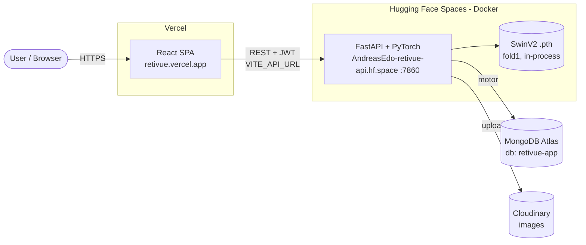
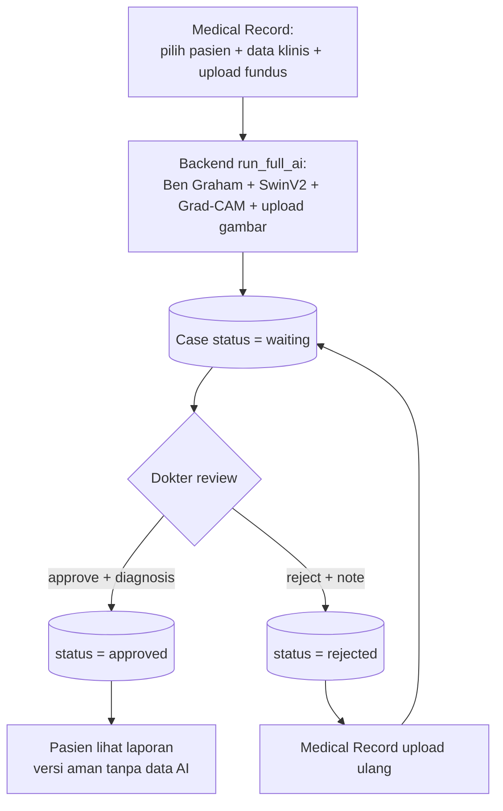
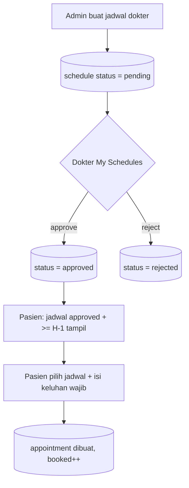
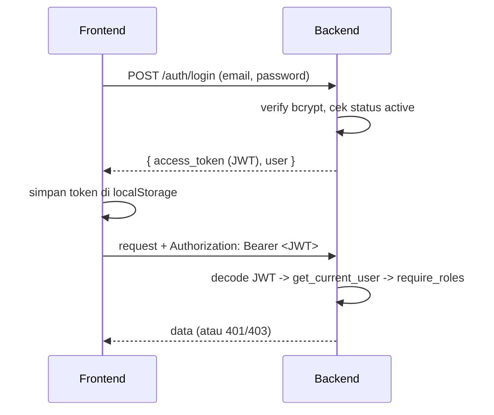

# RetiVue — Architecture Overview

> Dokumen konteks arsitektur lengkap untuk tim. Tujuannya: siapa pun yang baru
> masuk bisa paham sistem end-to-end tanpa harus baca semua kode.
> Pendamping dokumen: [DATABASE_DESIGN.md](./DATABASE_DESIGN.md) (model data + ERD).

---

## 1. Apa itu RetiVue

Platform **telemedicine skrining Diabetic Retinopathy (DR)** berbasis AI untuk ASEAN
(ASEAN AI Hackathon 2026, track Telemedicine). Tenaga kesehatan mengunggah foto
fundus retina, model AI memprediksi tingkat keparahan DR (**Grade 0–4**), dan hasilnya
dipakai sebagai **alat bantu triase** — bukan diagnosis final.

**Prinsip non-negotiable — Human-in-the-Loop:** AI hanya membantu; keputusan akhir
selalu di tangan dokter mata. Disclaimer ini wajib tampil di UI & response API.

Grade DR (ordinal): `0 = No DR · 1 = Mild · 2 = Moderate · 3 = Severe · 4 = Proliferative`.

---

## 2. Tech Stack — "FARM"

**F**astAPI + **R**eact + **M**ongoDB. Backend harus Python karena model = PyTorch
(tidak bisa dijalankan Node), jadi model di-load in-process di FastAPI.

| Layer | Teknologi | Hosting | Biaya |
|-------|-----------|---------|-------|
| Frontend | React 18 + Vite + Tailwind v3 + React Router v7 | **Vercel** | Gratis |
| Backend + Model | **FastAPI + PyTorch (CPU)** | **Hugging Face Spaces** (Docker, port 7860) | Gratis |
| Database | MongoDB (driver `motor` async) | **MongoDB Atlas** (M0) | Gratis |
| Image storage | Cloudinary (fallback base64 di Mongo) | Cloudinary free tier | Gratis |
| Auth | JWT (`python-jose`) + bcrypt | in-app | — |

> Kenapa HF Spaces, bukan Render: model Swin V2 Base butuh RAM besar. HF free tier
> = 2 vCPU + 16 GB RAM, cukup untuk load + inferensi CPU. Catatan: Space "tidur"
> setelah idle ~48 jam, bangun lagi saat diakses (cold start beberapa detik).

---

## 3. Topologi Deployment



- **Frontend → Backend**: REST, base URL dari env `VITE_API_URL` (di-bake saat build).
- **Backend → DB**: `motor` async, satu koneksi global (dibuka saat startup).
- **Model**: di-load **sekali** saat startup (lifespan), disimpan di state global, CPU-only.

### URL & repo
| Item | Nilai |
|------|-------|
| Frontend (Vercel) | `retivue.vercel.app` (root dir = `frontend/`, env `VITE_API_URL`) |
| Backend (HF Space) | `https://AndreasEdo-retivue-api.hf.space` |
| Source repo (GitHub) | `github.com/AndreasEdo/retivue_2` (frontend + backend) |
| Backend deploy repo | repo Space HF terpisah (`retivue-hf-deploy/`, push manual pakai token) |

---

## 4. Struktur Repository

```
retivue_2/
├── backend/                      # FastAPI + model (deploy ke HF Spaces)
│   ├── app/
│   │   ├── main.py               # app + lifespan (load model, connect DB, seed) + /health
│   │   ├── config.py             # pydantic-settings dari .env
│   │   ├── db.py                 # koneksi motor + nama koleksi
│   │   ├── security.py           # JWT, bcrypt, get_current_user, require_roles
│   │   ├── seed.py               # seed 4 akun demo + jadwal contoh + migrasi email
│   │   ├── state.py              # STATE global (model, thresholds)
│   │   ├── schemas.py            # Pydantic request/response
│   │   ├── utils.py              # serialize ObjectId, oid(), now_utc()
│   │   ├── model.py              # DRSwinV2Model + load_models + warmup
│   │   ├── preprocessing.py      # Ben Graham + crop + transform validasi
│   │   ├── inference.py          # predict(image_bytes) -> grade/score/confidence
│   │   ├── explain.py            # Grad-CAM (Swin reshape_transform)
│   │   ├── ai_runner.py          # run_full_ai: predict + Grad-CAM + upload -> ai_result+images
│   │   ├── cloudinary_util.py    # upload gambar / data-uri (fallback base64)
│   │   └── routers/
│   │       ├── auth.py           # /auth   (login, register pasien, me)
│   │       ├── ai.py             # /ai     (predict, explain — dipakai standalone/debug)
│   │       ├── admin.py          # /admin  (users, patients, schedules, monitoring)
│   │       ├── medical_record.py # /mr     (submissions + AI, history, rejected)
│   │       ├── doctor.py         # /doctor (cases review, schedule approval)
│   │       └── patient.py        # /patient(doctors, schedules, appointments, reports)
│   ├── models/  swinv2_best_fold1..4.pth   # bobot (TIDAK di-commit ke git)
│   ├── Dockerfile                # python:3.11-slim, torch CPU wheel, port 7860
│   └── requirements.txt
│
├── frontend/                     # React (Vite) -> Vercel
│   ├── src/
│   │   ├── main.jsx / App.jsx     # mount RouterProvider
│   │   ├── router.jsx             # semua route + ProtectedRoute + RootLayout
│   │   ├── index.css             # Tailwind + dark-mode overrides + animasi
│   │   ├── context/
│   │   │   ├── AuthContext.jsx    # JWT auth state (login/register/logout/me)
│   │   │   └── ThemeContext.jsx   # light/dark mode (localStorage)
│   │   ├── layouts/
│   │   │   ├── AuthLayout.jsx     # login/register (navy bg, Back + dark toggle)
│   │   │   └── AppLayout.jsx      # sidebar + topbar (role-based nav)
│   │   ├── lib/
│   │   │   ├── api.js             # semua fetch ke backend + token helper
│   │   │   ├── validation.js      # validator form (email, phone, H-1, image)
│   │   │   └── pdf.js             # generate PDF report (jsPDF, dynamic import)
│   │   ├── components/ui/         # ClinicalCard, DataTable, Modal, StepWizard, dst
│   │   ├── components/SplashScreen.jsx
│   │   └── pages/                 # per role: admin/ medical_record/ doctor/ patient/
│   ├── vercel.json               # SPA rewrite -> /index.html (fix 404 refresh)
│   └── tailwind.config.js        # darkMode: 'class'
│
├── docs/
│   ├── ARCHITECTURE.md           # dokumen ini
│   └── DATABASE_DESIGN.md        # model data + ERD
└── CLAUDE.md                     # konteks proyek + kontrak model AI
```

> Catatan: `src/components/{LoginPage,UploadCard,ResultCard,ExplainView}.jsx` adalah
> sisa tool single-page lama, **tidak dipakai** app multi-role (tidak diimpor router).

---

## 5. Role & Workflow

Empat role (semua disimpan di koleksi `users`, dibedakan field `role`):

| Role | Akses utama |
|------|-------------|
| `admin` | Kelola staff (dokter & medical record), pasien, jadwal dokter, monitoring |
| `medical_record` | Submit foto fundus + jalankan AI, lihat history & kasus rejected. **TIDAK melihat hasil AI** |
| `dokter` | Review kasus (approve/reject + diagnosis), approve/reject jadwal miliknya |
| `pasien` | Booking appointment (isi keluhan), lihat laporan yang sudah disetujui dokter |

### Alur kasus screening (inti)


### Alur jadwal & appointment


**Aturan bisnis penting:**
- **Doctor schedule approval**: jadwal baru `pending`; hanya `approved` yang tampil ke pasien.
- **H-1 booking**: pasien hanya bisa booking jadwal yang ≥ 1 hari dari hari ini.
- **Keluhan wajib**: booking butuh field *Reason for Visit / Complaint*.
- **Privasi pasien**: `_patient_safe_report()` membuang `ai_result`, confidence,
  probabilities, Grad-CAM. Pasien hanya lihat gambar asli + diagnosis dokter.
- **MR tidak lihat AI**: setelah submit, MR hanya melihat status "terkirim ke dokter".

---

## 6. Backend — FastAPI

### Startup (lifespan)
1. Load checkpoint `swinv2_best_fold1.pth` (`weights_only=False`) → `STATE["models"]`, `STATE["thresholds"]`.
2. `warmup()` 1x inferensi dummy.
3. `database.connect()` + `ping` + `run_seed()`.
4. Shutdown: `database.close()`.

### Request lifecycle (contoh `/mr/submissions`)
`multipart upload` → cek role (`require_roles`) → validasi gambar → `run_full_ai()`
(Ben Graham → SwinV2 score → threshold → grade → Grad-CAM → upload Cloudinary) →
simpan dokumen `case` (status `waiting`) → return ke MR (tanpa detail AI di UI MR).

### API surface (ringkas)
| Prefix | Endpoint | Role |
|--------|----------|------|
| `/health` | GET | publik (liveness; `model_loaded`, `db_connected`) |
| `/auth` | POST `/login`, POST `/register`, GET `/me` | publik / token |
| `/ai` | POST `/predict`, POST `/explain` | standalone AI (debug/demo) |
| `/admin` | `/users` (GET/POST), `/users/{id}/status` (PATCH), `/patients` (GET), `/schedules` (GET/POST/DELETE), `/monitoring` (GET) | admin |
| `/mr` | `/patients`,`/doctors`,`/dashboard` (GET); `/submissions` (GET/POST), `/submissions/rejected`, `/submissions/{id}`, `/submissions/{id}/resubmit` | medical_record |
| `/doctor` | `/dashboard`,`/cases`,`/cases/{id}` (GET); `/cases/{id}/approve|reject` (POST); `/schedules` (GET), `/schedules/{id}/approve|reject` (POST) | dokter |
| `/patient` | `/doctors`,`/schedules`,`/appointments` (GET); `/appointments` (POST); `/reports`,`/reports/{id}` (GET) | pasien |

Semua route role di-guard `dependencies=[Depends(require_roles(...))]`.

---

## 7. AI / ML Pipeline (kontrak model — kritis)

- **Arsitektur**: `DRSwinV2Model` = backbone `timm swinv2_base_window16_256`
  (`pretrained=False`, `num_classes=0`, `global_pool='avg'`) + head regresi
  `Dropout(0.3) → Linear(in,512) → SiLU → Linear(512,1)`. Output = **skor regresi
  kontinu ~[0,4]**, bukan probabilitas.
- **Checkpoint** = dict (`model_state_dict`, `thresholds`, `config`, …). Wajib
  `torch.load(..., weights_only=False)`.
- **Preprocessing Ben Graham** (harus persis dengan notebook): BGR→RGB →
  `crop_image_from_gray(tol=7)` → resize 256×256 → `addWeighted(4, GaussianBlur, -4, 128)`
  → Albumentations `Normalize(ImageNet)` + `ToTensorV2` → `unsqueeze(0)`.
- **Score → Grade**: threshold dari checkpoint (mis. `[0.53,1.49,2.39,3.40]`);
  fallback `[0.5,1.5,2.5,3.5]`.
- **Single fold untuk demo**: load fold1 saja (hemat RAM/CPU). Ensemble 4-fold
  disiapkan via flag tapi default single.
- **Grad-CAM** (`pytorch_grad_cam`): target = skor regresi; target layer di blok
  atensi terakhir; `reshape_transform` menyesuaikan format channels-last SwinV2
  `[B,H,W,C]`; grid 8×8 (input 256). Jalur ini butuh gradien (terpisah dari
  `/predict` yang pakai `no_grad`).
- **Metrik training (pitch)**: 5-fold OOF **QWK 0.9281**. (Kartu CV di UI dokter
  menampilkan angka training statis, bukan dari API.)

---

## 8. Auth & Security



- **JWT** payload: `sub` (user id), `role`, `name`, `exp`. Secret = `JWT_SECRET`.
- **Password**: bcrypt (tidak pernah dikembalikan ke client).
- **Role guard**: `require_roles("admin")` dst per router.
- **Frontend**: token di `localStorage` (`retivue_token`); `AuthContext` re-validasi
  via `/auth/me` saat mount. 401 → token dihapus. (Data pasien TIDAK disimpan di
  localStorage.)
- **CORS**: izinkan origin Vercel + `localhost:5173` (dev).

---

## 9. Data Layer (ringkas)

Koleksi MongoDB: `users`, `schedules`, `appointments`, `cases` (+ `patients` belum
dipakai). Relasi via string ObjectId, beberapa field di-denormalisasi
(`doctor_name`, `patient_name`). Sub-dokumen embedded di `cases`: `patient_data`,
`ai_result`, `images`, `doctor_result`. **Detail field + ERD ada di
[DATABASE_DESIGN.md](./DATABASE_DESIGN.md).**

---

## 10. Frontend — React

- **Routing**: `createBrowserRouter`. `RootLayout` membungkus `ThemeProvider` +
  `AuthProvider` + `SplashScreen`. `ProtectedRoute` cek login + role; redirect ke
  dashboard sesuai role. SPA fallback via `vercel.json` (fix 404 saat refresh).
- **Layouts**: `AuthLayout` (login/register), `AppLayout` (sidebar role-based +
  topbar + dark toggle; Logout di kiri bawah).
- **State**: `AuthContext` (user/token), `ThemeContext` (light/dark via class di `<html>`).
- **API client** `lib/api.js`: satu `request()` helper (inject Bearer, handle 401/error).
- **Styling**: Tailwind v3, `darkMode: 'class'`. Dark mode pakai override global
  `:where(.dark)` di `index.css` (menimpa utility terang, tetap menghormati varian
  `dark:` eksplisit).
- **PDF**: `lib/pdf.js` (jsPDF, dynamic import) → pasien download laporan klinis.
- **Validasi**: `lib/validation.js` dipakai di form login/register/staff/jadwal/submission/booking.

Peta halaman per role ada di `src/pages/{admin,medical_record,doctor,patient}/`.

---

## 11. Konfigurasi / Environment

**Backend (HF Space Secrets / `.env` lokal):**
| Key | Contoh | Catatan |
|-----|--------|---------|
| `MONGODB_URI` | `mongodb+srv://…@cluster0…/` | rahasia |
| `DB_NAME` | `retivue-app` | |
| `JWT_SECRET` | string acak | rahasia |
| `SEED_DEMO` | `true` | seed akun demo |
| `SEED_PASSWORD` | `Retivue123!` | password akun demo |
| `CLOUDINARY_CLOUD_NAME` / `_API_KEY` / `_API_SECRET` | … | opsional (fallback base64) |

**Frontend (Vercel env):** hanya `VITE_API_URL = https://AndreasEdo-retivue-api.hf.space`
(di-bake saat build → **harus redeploy** kalau diubah). ⚠️ Jangan taruh secret backend
di frontend — `VITE_*` terekspos publik di bundle.

**Akun demo:** `admin@gmail.com` / `dokter@gmail.com` / `mr@gmail.com` /
`pasien@gmail.com`, semua password `Retivue123!`.

---

## 12. Local Dev & Deploy

**Backend lokal:** `cd backend && uvicorn app.main:app --port 7860` (butuh `.env` +
bobot `.pth` di `backend/models/`).
**Frontend lokal:** `cd frontend && npm run dev` (`VITE_API_URL` default `localhost:7860`).

**Deploy:**
- Frontend → push GitHub → Vercel auto-deploy.
- Backend → push repo Space HF (`retivue-hf-deploy/`, butuh token) → HF rebuild Docker (~5 mnt).
- Database → MongoDB Atlas (shared; perubahan data langsung dilihat semua environment).

---

## 13. Constraints & Catatan

- **HF cold start**: request pertama setelah idle agak lama (Space bangun + load model).
- **Single fold**: demo pakai 1 model (fold1). Ensemble = enhancement.
- **`.pth` tidak di-commit** ke git (besar); diletakkan langsung di repo Space.
- **Bobot model = sumber kebenaran**: paritas preprocessing Ben Graham wajib persis,
  kalau beda sedikit prediksi ngaco.
- **Disclaimer Human-in-the-Loop** wajib di setiap output (UI + API).
- **Kartu CV metrics** di UI dokter = angka training statis (bukan dari API).
