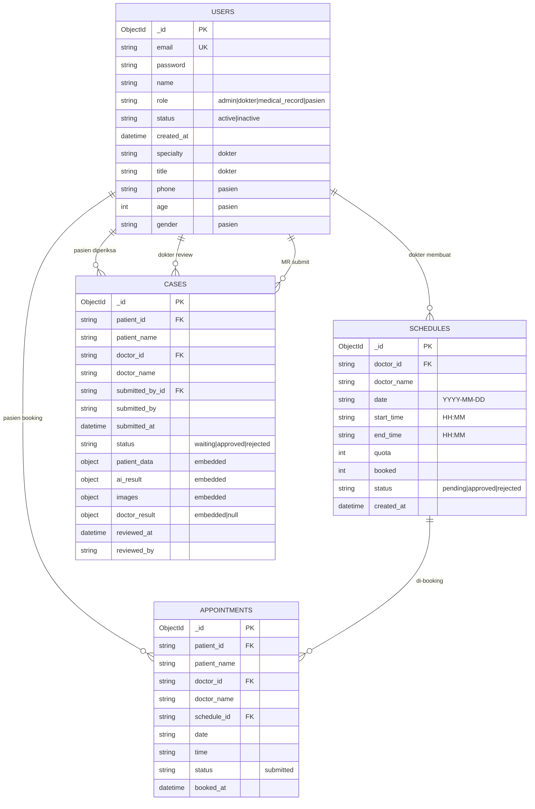

# RetiVue — Database Design (untuk ERD)

> Dokumen ini mendeskripsikan model data RetiVue secara lengkap supaya bisa
> dipakai sebagai konteks untuk meng-generate ERD (mis. via Gemini/Claude) atau
> membuat diagram di tools seperti dbdiagram.io / Mermaid / draw.io.

## 0. Konteks singkat

- **Database**: MongoDB (NoSQL, dokumen/JSON). Driver: `motor` (async).
- **Bukan relational** — tidak ada foreign key fisik. Relasi dibuat lewat
  **string ObjectId** yang disimpan di field (mis. `doctor_id`), dan beberapa
  nilai **didenormalisasi** (mis. `doctor_name` disalin ke dokumen lain supaya
  tidak perlu join). Untuk ERD, perlakukan field `*_id` sebagai foreign key
  logis ke `users._id` / `schedules._id`.
- **Primary key** tiap koleksi: `_id` (ObjectId, otomatis dari MongoDB).
- Semua timestamp = UTC (`datetime`), tanggal jadwal = string `YYYY-MM-DD`,
  jam = string `HH:MM`.

## 1. Daftar koleksi (entities)

| Koleksi | Fungsi |
|---------|--------|
| `users` | Semua akun: admin, dokter, medical_record, pasien (single table, dibedakan `role`) |
| `schedules` | Jadwal praktik dokter (dibuat admin, di-approve dokter) |
| `appointments` | Booking pasien terhadap sebuah schedule |
| `cases` | Submission screening: data klinis + hasil AI + review dokter (inti workflow) |
| `patients` | **Dicadangkan tapi belum dipakai.** Profil pasien saat ini disimpan di `users` (role=pasien). Boleh diabaikan di ERD, atau digambar sebagai entitas future. |

---

## 2. Koleksi `users`

Satu koleksi untuk **semua role**. Field opsional hanya terisi sesuai role.

| Field | Tipe | Wajib | Keterangan |
|-------|------|-------|------------|
| `_id` | ObjectId | ✔ (PK) | Primary key |
| `email` | string | ✔ | **Unique** (ada unique index). Lowercase. Dipakai untuk login |
| `password` | string | ✔ | Hash bcrypt. **Tidak pernah** dikembalikan ke client |
| `name` | string | ✔ | Nama lengkap |
| `role` | enum string | ✔ | `admin` \| `dokter` \| `medical_record` \| `pasien` |
| `status` | enum string | ✔ | `active` \| `inactive` |
| `created_at` | datetime | ✔ | Waktu pembuatan |
| `specialty` | string | – | **dokter saja**, mis. `Ophthalmologist` |
| `title` | string | – | **dokter saja**, mis. `Sp.M` |
| `phone` | string | – | **pasien saja** |
| `age` | int | – | **pasien saja** |
| `gender` | string | – | **pasien saja** (`Male` \| `Female`) |

**Catatan role:**
- `admin` — kelola user, pasien, jadwal, monitoring.
- `dokter` — review case (approve/reject) + approve/reject jadwal miliknya.
- `medical_record` — buat submission (jalankan AI), tidak melihat hasil AI.
- `pasien` — booking appointment, lihat laporan yang sudah disetujui dokter.

---

## 3. Koleksi `schedules`

Jadwal praktik dokter. Dibuat admin (status awal `pending`), lalu dokter
meng-approve sebelum bisa dilihat & di-booking pasien.

| Field | Tipe | Wajib | Keterangan |
|-------|------|-------|------------|
| `_id` | ObjectId | ✔ (PK) | |
| `doctor_id` | string (→ users._id) | ✔ | **FK** ke dokter pemilik jadwal |
| `doctor_name` | string | ✔ | Denormalisasi nama dokter |
| `date` | string `YYYY-MM-DD` | ✔ | Tanggal praktik |
| `start_time` | string `HH:MM` | ✔ | Jam mulai |
| `end_time` | string `HH:MM` | ✔ | Jam selesai |
| `quota` | int | ✔ | Kapasitas slot (default 10) |
| `booked` | int | ✔ | Jumlah slot terisi (naik saat ada appointment) |
| `status` | enum string | ✔ | `pending` \| `approved` \| `rejected` |
| `created_at` | datetime | ✔ | |

> Aturan bisnis: pasien hanya melihat schedule `status=approved` dan hanya bisa
> booking **H-1** (minimal 1 hari sebelum `date`). `available = quota - booked`.

---

## 4. Koleksi `appointments`

Hasil booking pasien terhadap satu schedule.

| Field | Tipe | Wajib | Keterangan |
|-------|------|-------|------------|
| `_id` | ObjectId | ✔ (PK) | |
| `patient_id` | string (→ users._id) | ✔ | **FK** pasien |
| `patient_name` | string | ✔ | Denormalisasi |
| `doctor_id` | string (→ users._id) | ✔ | **FK** dokter (disalin dari schedule) |
| `doctor_name` | string | ✔ | Denormalisasi |
| `schedule_id` | string (→ schedules._id) | ✔ | **FK** schedule yang di-booking |
| `date` | string `YYYY-MM-DD` | ✔ | Disalin dari schedule |
| `time` | string `HH:MM` | ✔ | Disalin dari `schedule.start_time` |
| `status` | enum string | ✔ | `submitted` (nilai awal; bisa dikembangkan: `confirmed`/`done`) |
| `booked_at` | datetime | ✔ | Waktu booking |

---

## 5. Koleksi `cases` (inti workflow)

Satu dokumen = satu submission screening. Berisi **3 sub-dokumen tertanam**
(`patient_data`, `ai_result`, `images`) plus hasil review dokter (`doctor_result`).

| Field | Tipe | Wajib | Keterangan |
|-------|------|-------|------------|
| `_id` | ObjectId | ✔ (PK) | |
| `patient_id` | string (→ users._id) | ✔ | **FK** pasien yang diperiksa |
| `patient_name` | string | ✔ | Denormalisasi |
| `doctor_id` | string (→ users._id) | ✔ | **FK** dokter penanggung jawab review |
| `doctor_name` | string | ✔ | Denormalisasi |
| `submitted_by` | string | ✔ | Nama staff medical_record |
| `submitted_by_id` | string (→ users._id) | ✔ | **FK** staff medical_record |
| `submitted_at` | datetime | ✔ | Waktu submit |
| `status` | enum string | ✔ | `waiting` \| `approved` \| `rejected` |
| `patient_data` | object | ✔ | Data klinis pendukung (lihat 5.1) |
| `ai_result` | object | ✔ | Hasil model AI (lihat 5.2) |
| `images` | object | ✔ | URL gambar (lihat 5.3) |
| `doctor_result` | object \| null | – | Hasil review dokter (lihat 5.4); `null` selama `waiting` |
| `reviewed_at` | datetime | – | Diisi saat approve/reject |
| `reviewed_by` | string | – | Nama dokter yang mereview |
| `resubmitted_at` | datetime | – | Diisi jika case rejected lalu di-upload ulang |

### 5.1 `cases.patient_data` (embedded)
| Field | Tipe | Keterangan |
|-------|------|------------|
| `age` | int | Usia saat pemeriksaan |
| `gender` | string | `Male` \| `Female` |
| `weight` | float | kg |
| `height` | float | cm |
| `blood_pressure` | string | mis. `120/80` |
| `has_diabetes` | bool | |
| `diabetes_duration` | int | tahun (jika diabetes) |

### 5.2 `cases.ai_result` (embedded)
| Field | Tipe | Keterangan |
|-------|------|------------|
| `grade` | int | 0–4 (tingkat DR) |
| `label` | string | `No DR`/`Mild`/`Moderate`/`Severe`/`Proliferative DR` |
| `predicted_class` | string | = label |
| `raw_score` | float | Skor regresi kontinu ~[0,4] |
| `confidence` | float | 0–1 |
| `thresholds` | array<float> | Threshold score→grade dari checkpoint |
| `probabilities` | object | Estimasi prob per kelas (soft) |
| `recommendation` | string | Rekomendasi triase AI |

> **Privasi:** seluruh `ai_result`, `confidence`, `probabilities`, dan gambar
> Grad-CAM **tidak pernah** ditampilkan ke pasien — hanya dokter. Pasien hanya
> melihat `doctor_result` + gambar original.

### 5.3 `cases.images` (embedded)
| Field | Tipe | Keterangan |
|-------|------|------------|
| `original_url` | string (URL) | Foto fundus asli (Cloudinary / base64 fallback) |
| `ben_graham_url` | string (URL) | Hasil preprocessing Ben Graham |
| `gradcam_url` | string (URL) | Heatmap Grad-CAM (dokter saja) |

### 5.4 `cases.doctor_result` (embedded, diisi saat review)
**Jika approve:**
| Field | Tipe | Keterangan |
|-------|------|------------|
| `final_diagnosis` | string | Diagnosis final dokter |
| `lifestyle_recommendation` | string | |
| `food_recommendation` | string | |
| `follow_up_plan` | string | |

**Jika reject:**
| Field | Tipe | Keterangan |
|-------|------|------------|
| `reject_note` | string | Alasan ditolak (untuk upload ulang oleh medical_record) |

---

## 6. Relasi (untuk ERD)

Semua relasi 1—N, FK = string ObjectId.

```
users (role=dokter)        1 ── N  schedules        (schedules.doctor_id)
schedules                  1 ── N  appointments     (appointments.schedule_id)
users (role=pasien)        1 ── N  appointments     (appointments.patient_id)
users (role=dokter)        1 ── N  appointments     (appointments.doctor_id)
users (role=pasien)        1 ── N  cases            (cases.patient_id)
users (role=dokter)        1 ── N  cases            (cases.doctor_id)
users (role=medical_record)1 ── N  cases            (cases.submitted_by_id)
```

Sub-dokumen tertanam (bukan koleksi terpisah, embedded di `cases`):
`patient_data`, `ai_result`, `images`, `doctor_result`.

---

## 7. Enum / nilai status (ringkasan)

| Field | Nilai |
|-------|-------|
| `users.role` | `admin`, `dokter`, `medical_record`, `pasien` |
| `users.status` | `active`, `inactive` |
| `schedules.status` | `pending`, `approved`, `rejected` |
| `appointments.status` | `submitted` (default; ekstensi: `confirmed`, `done`) |
| `cases.status` | `waiting`, `approved`, `rejected` |
| `cases.ai_result.grade` | `0`=No DR, `1`=Mild, `2`=Moderate, `3`=Severe, `4`=Proliferative DR |

---

## 8. Diagram Mermaid (siap render)

> MongoDB schemaless, tapi digambar sebagai entitas relasional untuk ERD.
> Tempel ke https://mermaid.live atau editor apa pun yang dukung Mermaid.



---

## 9. Catatan untuk yang membuat ERD

- `users` sengaja **single-table inheritance** (1 koleksi, dibedakan `role`).
  Jika ingin ERD lebih normalisasi, boleh dipecah jadi `Admin`, `Doctor`,
  `MedicalRecord`, `Patient` yang mewarisi `User` — tapi implementasi nyatanya
  satu koleksi `users`.
- Field `*_name` (doctor_name, patient_name) adalah **denormalisasi** (snapshot),
  bukan relasi terpisah — wajar di MongoDB, boleh diabaikan saat menggambar relasi.
- `patient_data`, `ai_result`, `images`, `doctor_result` adalah **embedded
  documents** di dalam `cases`, bukan tabel terpisah. Di ERD relasional murni
  bisa digambar sebagai tabel anak 1—1 ke `cases` kalau perlu.
- Koleksi `patients` ada di konstanta kode tapi **belum dipakai** — abaikan
  kecuali ingin memodelkan rencana ke depan.
